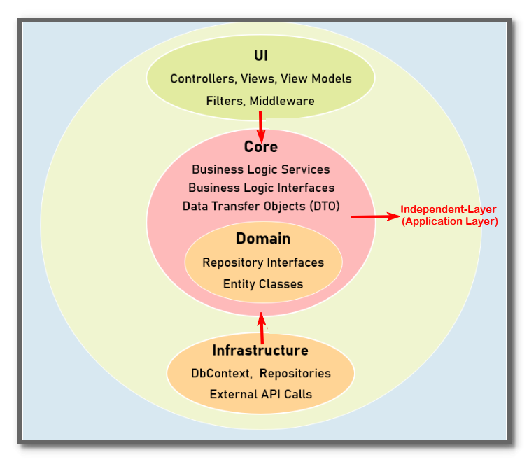

<h1 align="center">ServicesProvider</h1>
<h3 align="center"><strong>Powerful .NET 8 Services Provider APIs</strong></h3>

Extend your application with it and customize it as per your own requirements 

Live demo : [Services Provider Live](https://services-provider-container-app.delightfulsea-eb38f2b4.australiaeast.azurecontainerapps.io)

# Core Features:

- **User Registration:** Allow users to sign up with their unique email address and a strong password.

- **Account Verification:** Upon registration, generate a verification token which:

  - Is sent to the registered email address via a unique link.
  - Can be used to verify the user's account by accessing the specified endpoint using Swagger, Postman, or any other HTTP(S) supported method.

- **OAuth2.0 standard:** Utilize OAuth2.0 for secure authentication and authorization:

  - Implement Access Tokens with short expiration times and Refresh Tokens for longer-term authentication.
  - Define token endpoints for generating new Access Tokens using Refresh Tokens after validation.

- **Role-Based Permissions:** Each module's endpoints, excluding Accounts, require separate authorization to access.

  - Implement role-based access control (RBAC) to define different levels of permissions for users.
  - Define roles such as Admin, User, etc., and assign appropriate permissions to each role.

- **Cloud Storage:** Integrated with **Azure Blob Storage** for scalable and cost-effective storage of media files.

- **Builder Pattern:** Utilized the Builder Pattern for creating complex objects with flexible configurations.

- **Serverless Architecture:** Docker Image created while publishing the application:

  - Uses Azure Container Registry (ACR) to store that Image, Application Image uploaded to this Registry.
  - Azure Container App configured with that registry, which runs the Application Image, creates an access URL, and makes this app available for users.

- **Monitoring Logs:** Implement logging mechanisms to capture application events and errors for monitoring and debugging purposes.

  - Utilize the Serilog framework to store logs centrally and analyze them efficiently.

# Technologies

 - [.NET 8](https://learn.microsoft.com/en-us/dotnet/core/whats-new/dotnet-8)
 - [EntityFramework](https://learn.microsoft.com/en-us/ef/)
 - [SQL Server](https://www.microsoft.com/en-us/sql-server/sql-server-downloads)
 - [Microsoft Dependency Injection (DI)](https://learn.microsoft.com/en-us/dotnet/core/extensions/dependency-injection)
 - [Azure Storage](https://azure.microsoft.com/en-us/products/storage/blobs)
 - [JWT](https://jwt.io/)
 - [Docker](https://www.docker.com/)
 - [Serilog](https://serilog.net/)
 - [Swashbuckle (Swagger)](https://learn.microsoft.com/en-us/aspnet/core/tutorials/getting-started-with-swashbuckle?view=aspnetcore-7.0&tabs=visual-studio)

 - [AutoMapper](https://automapper.org/)

 ## Clean Architecture
 This application is followed by clean architecture. This Application is divided into 3 major parts as Shown in following Image:

Let's discuss about each layer of Clean Architecture:

- ### UI 

- ### Core 
    >*This layer also know as **Application Layer**, In some scenerios.*

   This portion is considered the heart of application. Other layers are dependent of it but it is independent , which is thumb rule of clean architecture. It is not effected if any change happend in UI  or Architectural layer. It further divided into 2 followind portions:

   - **Business Logic:**

     All the business logic and rules are implimented here. This layer receive the data from UI ,validate , perform calculations on it, and send it to infrastructure layer for external operations. Once External operations are done then it receive the responce , validate and prepare responce then send it to UI layer.

     It could be include:
     - **Services Interface:**
     - **Services:** 
     - **DTOs:**
     - **Enums:** 
     - **Shared:** 
     - **Builders:**

   - **Domain:**
      
      This portion is further divided into 2 portion:

      - **Repository Interfaces:**
      - **Entity Classes:**

- ### Infrastructure 
   This layer is responcible for **external operation** like getting or sending data to DataBase, connectivity to another server like SMTP or Google Maps e.t.c.
   
   In this Application, All the external calls are written here like read, write data to DataBase, upload and download Images from Azure Cloud Storage or like that.

   **Note:**

   >No affect on Business layer if data source is changes in this layer.

## Solid Principles Overview: 
If we talk about Solid Principles Adherence  in this Application, Here is the overview of each principle:

   - **Single Responsibility Principle (SRP) :** it says *A class should have only one reason to change, meaning it should have only one job or responsibility.*

      I tried that each class should for single responcibility, I don't imliment it very deeply If i do so then there would be muchmuch file and project would be bulky.
   - **Open/Closed Principle (OCP):** it says *Application entities (classes, modules, functions, etc.) should be open for extension but closed for modification.*

      I impliment that principle , make a generic repository and general purpose methods, if any module needs specific methods then I inherit generic repository and define the required method
   - **Liskov Substitution Principle (LSP):** it says Subtypes must be substitutable for their base type.
      This project implimentation not fully impliment that principle, becouse in some case if we substitute subtype (child class) with basetype (parent class) , application behaviour changes, not remains same

   - **Interface Segregation Principle (ISP):** it says *Clients should not be forced to depend on interfaces that he not need.* 

      I implimentthat that principle and segregate interfaces in that way if client wants to impliment any interface  all method would be useful for him, there is no such method to impliment which is unnecessory, but he has to impliment forcefully 

   - **Dependency Inversion Principle (DIP):** *it says High-level modules should not depend on low-level modules. Both should depend on abstraction*

      I impliment that principle in this project .For example, If we see any service implimentation , it needed a repository for external calls. I notice you will see that these services does't depent on repository directly but depent on abstract class of that repository, which in Interface in our case( becouse all methods are abstract, no concerete implimentation).
 

## Repository Pattern:

There is specific repository for each business entity, It is very useful when we need to change our data source. If datasource change, all responsibility is of it, Rest of application would not be effected, and will do the same working.
   
There are 2 following folders in this application which implimenting Repository Pattern :
   - **Repository Interfaces:**

      This is the ***abstruction*** of Entity Class Operations. This folder resides in Core > Domain folder of application .It has the interfaces for each business entity which describe what we do with that entity, ranther than implimentation.

   - **Repositories :**

      It is the ***Implimentation*** the Repository interface and we define the logic to perform the external operation. These are resides in Infrastructure layer.

## Role

Here is  the list roles :

| Sr. | Role Name |Default Role|
| --- | -------- |:---:|
| 1   | Admin    |✖|
| 2   | Manager  |✖|
| 3   | User     |✔|

# Role's Permissions

**Admin Permissions:**

| Module Name     | CanAdd | CanEdit | CanView | CanDelete |
| -------------- | :------: | :-------: | :-------: | :---------: |
| Dashboard      |  ✔      | ✔       | ✔       | ✔         |
| Users          | ✔      | ✔       | ✔       | ✔         |
| Roles          | ✔      | ✔       | ✔       | ✔         |
| Categories     | ✔      | ✔       | ✔       | ✔         |
| CoreActivities | ✔      | ✔       | ✔       | ✔         |
| Services       | ✔      | ✔       | ✔       | ✔         |
| AzureStorage   | ✔      | ✔       | ✔       | ✔         |

**Manager Permissions:**

|   ModuleName          | CanAdd | CanEdit | CanView | CanDelete |
| --------------- | :----: | :-----: | :-----: | :-------: |
| Dashboard       |   ✖    |    ✖    |    ✔    |    ✖      |
| Users           |   ✖    |    ✖    |    ✔    |    ✖      |
| Roles           |   ✖    |    ✖    |    ✔    |    ✖      |
| Categories      |   ✔    |    ✔    |    ✔    |    ✖      |
| CoreActivities  |   ✔    |    ✔    |    ✔    |    ✖      |
| Services        |   ✔    |    ✔    |    ✔    |    ✔      |
| AzureStorage    |   ✔    |    ✔    |    ✔    |    ✔      |

**User Permissions:** 

  

 | ModuleName     | CanAdd | CanEdit | CanView | CanDelete |
  | -------------- | :------: | :-------: | :-------: | :---------: |
  | Categories     | ✖      | ✖       | ✔       | ✖         |
  | CoreActivities | ✖      | ✖       | ✔       | ✖         |
  | Services       | ✖      | ✖       | ✔       | ✖         |
  | AzureStorage   | ✔      | ✖       | ✔       | ✖         |
  

## Users
Here is the list of Users with their Roles:

| UserName | Email            | Password  | Role(s) |
| -------- | :---------------- | :--------- | :--------- | 
| Alex     | alex@gmail.com  | Alex!510  |Admin|
| Stark    | stark@gmail.com | Stark@281 |Admin|
| John     | john@gmail.com  | John*412  |Manager, User|
| Chris    | chris@gmail.com | Chris#561 |Manager|
| Mike     | mike@gmail.com  | Mike&843  |User|
| Sara     | sara@gmail.com  | Sara$743  |User|

### Note:
> The Users with Admin role are not availalbe on **live Server**, but will work if you download this repo and run it local on your computer.

>you can use `UserName` or `Email` with Password to signIn.
